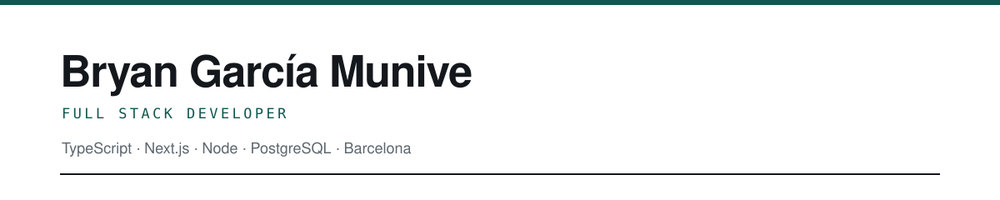
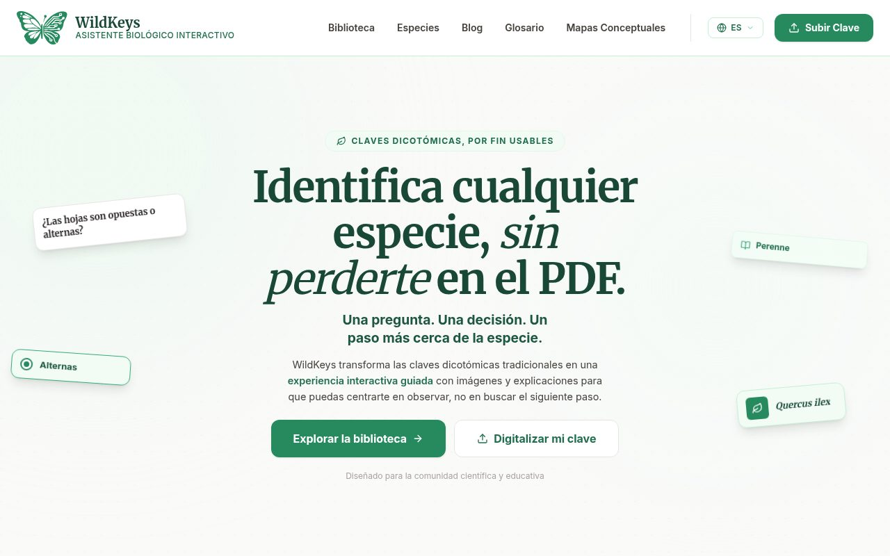
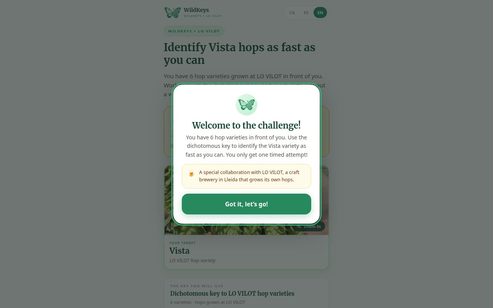
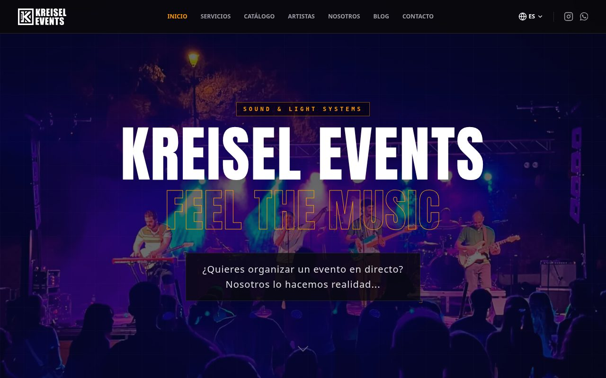

  

  
  
  
  
  
  
  
  
  

  Construyo sistemas de gestión a medida y los mantengo en producción. 
  Aquí está lo que se puede abrir; el resto es de clientes.

 

## Lo que se puede abrir

<table>
  <tr>
    <td width="33%" valign="top">
      
        
      <b><a href="https://wildkeys.io">wildkeys.io</a></b> 
      Identificación de especies con claves dicotómicas, en tres idiomas. CMS y editor visual propios. 
      Next.js · Supabase · CI con comprobación nocturna
    </td>
    <td width="33%" valign="top">
      
        
      <b><a href="https://games.wildkeys.io">games.wildkeys.io</a></b> 
      PWA que funciona sin conexión, con el motor de juego separado de React. Estrenada en un evento físico. 
      Vite · React · service worker · marcador con cola offline
    </td>
    <td width="33%" valign="top">
      
        
      <b><a href="https://kreiselevents.com">kreiselevents.com</a></b> 
      Astro con CMS headless propio: el cliente publica al instante sin perder el rendimiento de un sitio estático. 
      Astro · React · Supabase · JSON-LD, hreflang
    </td>
  </tr>
</table>

 

## Cómo trabajo

| | |
|---|---|
| **Decisiones escritas** | Cada decisión de arquitectura queda documentada, con lo que se descartó y por qué. |
| **Garantías en la base de datos** | Las reglas que no pueden fallar viven en RLS y restricciones, no en la convención. |
| **Pruebas antes del commit** | Lo que no pasa, no sale. |
| **Silencio por defecto** | Lo que corre solo, avisa solo si falla. |

 

  
  &nbsp;
  

